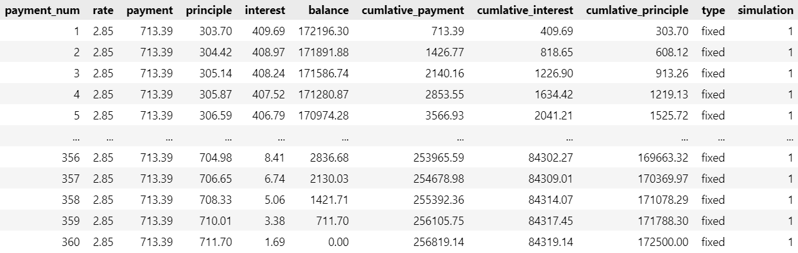
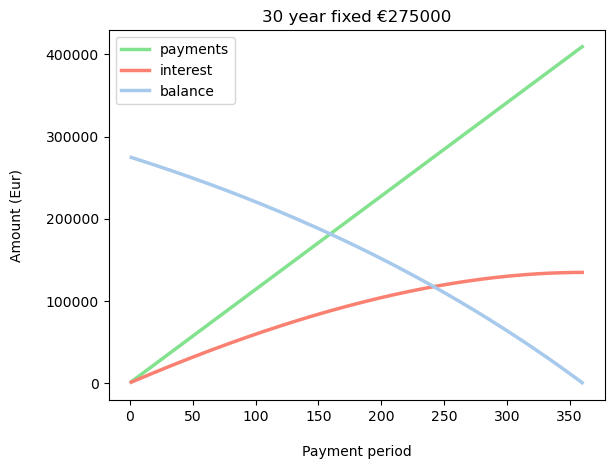

# Comparing Mortgage Offers

This project was developed to compare the cumulative costs of several mortgage scenarios.

The cumulative loan costs were compared with regards to:
- fixed vs variable interest rates
- variable spread percentages (the bank profit)
- total loan amounts

---

## Showcase

This project was designed to demonstrate Python skills with:

* data wrangling and cleaning with Pandas
* writing and calling functions
* plotting with MatPlotLib

---

## Use Cases

1. Plot interest rate fluctuations over time

2. Generate and export amortization schedules for various loans

3. Multiple simulations can be sumarized with a table for easy comparisons

4. Plotted to visualize differences in cumulative costs
   

---